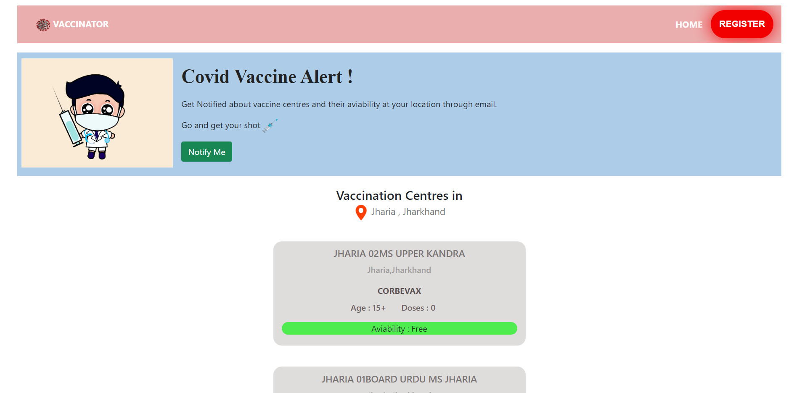
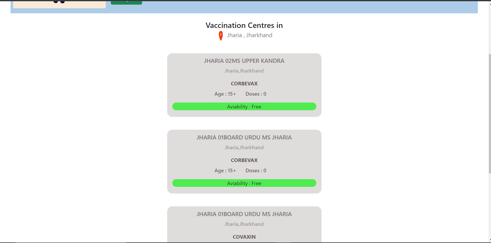
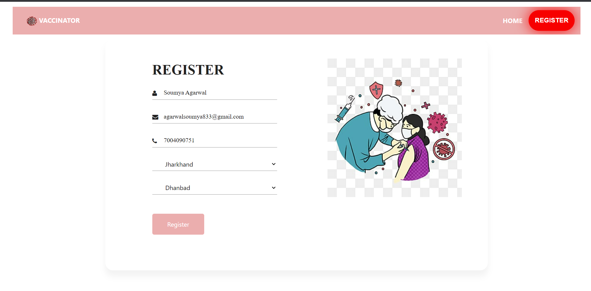
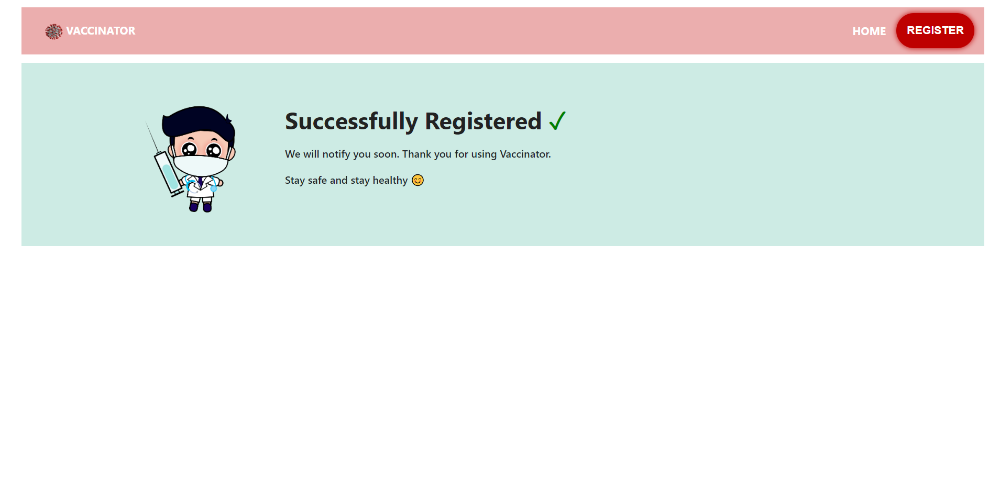
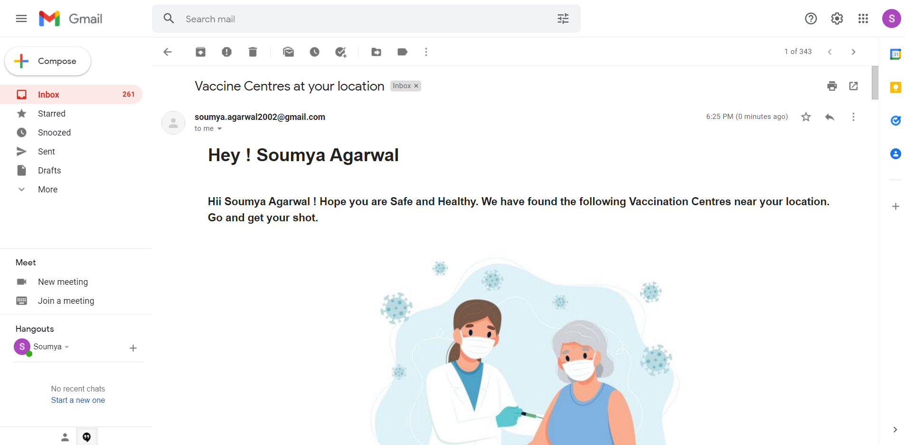
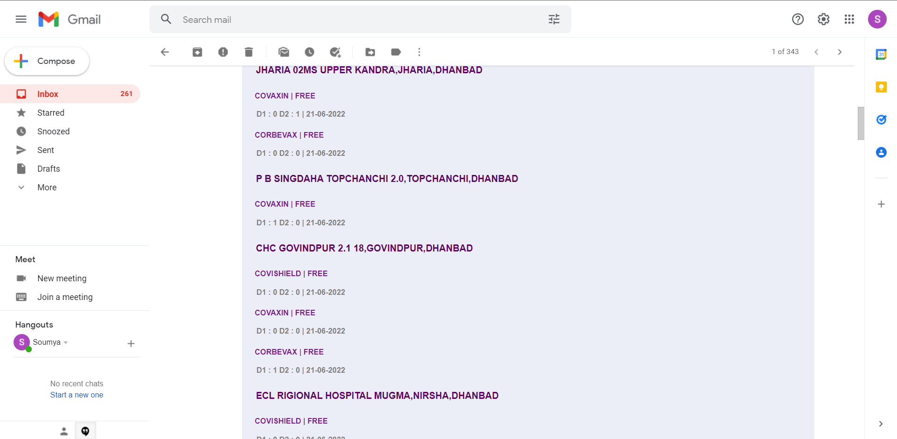

<div align="center">
  <h1 align="center">VACCINATER</h1>
  <h1 align="center">Go! Get your shot now</h1>
</div>

<!-- TABLE OF CONTENTS -->
<details open="open">
  <summary>Table of Contents</summary>
  <ol>
    <li>
      <a href="#about-the-project">About The Project</a>
      <ul>
        <li><a href="#compatible-platforms">Compatible Platforms</a></li>
        <li><a href="#built-with">Built With</a></li>
      </ul>
    </li>
    <li>
      <a href="#getting-started">Getting Started</a>
      <ul>
        <li><a href="#before-installation">Before Installation</a></li>
        <li><a href="#installation">Installation</a></li>
      </ul>
    </li>
    <li><a href="#navigating-through-the-app">Navigating through the App</a></li><ul>
        <li><a href="#home-page">Home Page</a></li>
        <li><a href="#register-page">Register Page</a></li>
        <li><a href="#sending-email">Sending Email</a></li>
      </ul>
    <li><a href="#need-help">Need Help?</a></li>
  </ol>
</details>

<!-- ABOUT THE PROJECT -->

## About The Project
* Vaccinater - Get notified about your daily dose of vaccine easily via email. 
* Displays all the current available vaccine centers at user location.  
* Displays center location along with the type of vaccine and available doses and more. 
* Users can get themselves registered so that they get notified about daily vaccine availability via email.


### Compatible Platforms
Laptops, Desktops and Tablet PCs

### Built With
* ![Front-end][front-end-shield]
* ![Back-end][back-end-shield]
* ![Database][database-shield]
* ![Tools][tools-shield]

## Getting Started
```sh
  git clone https://github.com/soumyag123/Vaccinater.git
```
```sh
  cd Vaccinater
```

## Before Installation
1. Replace your own mongoDB url. Refer to https://medium.com/featurepreneur/how-to-create-a-cluster-in-mongodb-28996662b3ac to create your cluster and set up your database.
3. Replace EMAIL and PASS with your own email id and password you want to use for Nodemailer.
4. Replace OAUTH_CLIENTID, OAUTH_CLIENT_SECRET and OAUTH_REFRESH_TOKEN with your own Google Cloud API Credentials. Refer to https://dev.to/chandrapantachhetri/sending-emails-securely-using-node-js-nodemailer-smtp-gmail-and-oauth2-g3a to create your OAUTH Credentials. 


### Installation
Run the following commands to start the app.
```sh
  npm install 
```
```sh
  npm run dev
```
Your app is now running on http://localhost:8000

<!-- APP TUTORIAL-->
## Navigating Through The App

## Home Page
   - Home Page of the website. Get information about all the available vaccine centers at user location. No. of doses available, type of vaccine, age limit and other information.
    
    

## Register Page
   - Users can get themselves registered to get updates about the vaccine via email.
    
    

## Sending Email
   - Email sent via Nodemailer to all the registered users about vaccine centers and their availability for next few days.
    
    
   

## Need Help?

Feel free to contact me on [LinkedIn](https://www.linkedin.com/in/soumya-agarwal20/)

---------

```javascript
if (youEnjoyed) {
    starThisRepository();
}
```


<!--MARKDOWN LINKS-->
[front-end-shield]: https://img.shields.io/badge/Front--end-EJS%20HTML-blueviolet
[back-end-shield]: https://img.shields.io/badge/Back--end-Node%20JS%2C%20Express-blueviolet
[tools-shield]: https://img.shields.io/badge/Tools-APISetu%20Nodemailer-blueviolet
[database-shield]: https://img.shields.io/badge/Database-MongoDB-blueviolet
